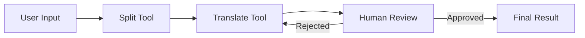

# AI Translator Agent

A powerful translation application powered by Large Language Model (LLM) agents, featuring context understanding, multi-turn dialogue, and intelligent decision-making capabilities.

## Features

- **AI Agent Architecture**: Built on a sophisticated agent system with autonomous decision-making
- **Human-in-the-loop**: Manual review and approval workflow for translation quality control
- **Smart Text Segmentation**: Automatically splits text into meaningful segments while preserving structure
- **Context-Aware Translation**: Maintains context across segments for accurate, natural translations
- **Interactive Source Mapping**: Hover and scroll synchronization between original and translated text
- **Iterative Refinement**: Reject and regenerate translations until satisfied
- **Multi-language Support**: Automatically detects source language and translates to target language (default: English)
- **Persistent Settings**: Your API configuration is saved locally

## Architecture

The application follows an agent-based workflow:

## Tools

**Split Tool**  
Intelligently segments text into natural language units while:
- Preserving all formatting (whitespace, line breaks, punctuation)
- Detecting sentence and paragraph boundaries
- Maintaining original character order

**Translate Tool**  
Translates text segments with:
- Context preservation
- Code block protection (no translation of code)
- Formatting retention
- Iterative refinement on rejection

## Workflow

1. **Text Submission**: User provides source text
2. **Segmentation**: Split tool breaks text into manageable segments
3. **Translation Loop**: For each segment:
   - Translate using LLM
   - Present to human reviewer
   - If approved: Save and continue
   - If rejected: Regenerate with feedback
4. **Completion**: Display synchronized results with interactive mapping
